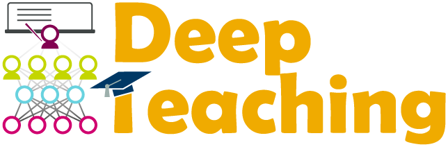

# Deep Teaching

This repository contains hands-on programming exercises from AstraZeneca's 'Deep Teaching' tutorials.

Tutorial slides to be added.

### Tutorial scope
* The monthly ‘Deep teaching’ tutorial aims to improve expertise and understanding of deep learning and other machine learning techniques and practices across audiences of (a) practitioners and (b) interested learners
* This is achieved with experts giving 1 hour tutorials followed by optional 1 hour hands-on coding exercises
* Tutorials will be a mix of high-level intuitions as well as fine mathematical / implementation details
* We aim to anchor tutorials with tangible, readily-grasped examples / case studies (esp. those relevant to drug discovery) to facilitate conceptual understanding
